# Design of Responsive Website
## AIM:
To design a responsive website with two break points.

## DESIGN STEPS:
### Step 1: 
Requirement collection.
### Step 2:
Creating the layout using HTML and CSS.
### Step 3:
Updating the sample content.
### Step 4:
Choose the appropriate style and color scheme.
### Step 5:
Validate the layout in various browsers.
### Step 6:
Validate the HTML code.
### Step 7:
Create a database model and migrate the database.
### Step 8:
Retrieve data from database and display it in a dynamic webpage.
### Step 9:
Publish the website in the given URL.

## PROGRAM:

### responsivebase.html
```

<!doctype html>
<html lang="en">
  <head>
    <!-- Required meta tags -->
    <meta charset="utf-8">
    <meta name="viewport" content="width=device-width, initial-scale=1, shrink-to-fit=no">

    <!-- Bootstrap CSS -->
    <link rel="stylesheet" href="https://maxcdn.bootstrapcdn.com/bootstrap/4.0.0/css/bootstrap.min.css" integrity="sha384-Gn5384xqQ1aoWXA+058RXPxPg6fy4IWvTNh0E263XmFcJlSAwiGgFAW/dAiS6JXm" crossorigin="anonymous">

    <title>Stark Private Limited</title>
  </head>
  <body>
    <div class="jumbotron">
        <div class="container text-center">
            <h1 class="display-3">Stark Private Limited</h1>
            <p class="lead">We manufacture high qualilty electronic products</p>
        </div>
    </div>
    <div class="container">
        <div class="row text-center">
            <div class="col-12 col-md-3"><a href="/responsivehome">Home</a></div>
            <div class="col-12 col-md-3"><a href="/responsiveproduct">Product</a></div>
            <div class="col-12 col-md-3"><a href="/responsivepeople">People</a></div>
            <div class="col-12 col-md-3"><a href="/responsivecontactus">Contact us</a></div>
        </div>
    </div>
    <div class="container">
        
    
    </div>
    <div class="container">
        <div class="row align-items-end">
            <div class="col text-center">
                Copyright © 2021 Stark Private Limited, Developed by Ragav
            </div>
        </div>
    </div>
    <!-- Optional JavaScript -->
    <!-- jQuery first, then Popper.js, then Bootstrap JS -->
    <script src="https://code.jquery.com/jquery-3.2.1.slim.min.js" integrity="sha384-KJ3o2DKtIkvYIK3UENzmM7KCkRr/rE9/Qpg6aAZGJwFDMVNA/GpGFF93hXpG5KkN" crossorigin="anonymous"></script>
    <script src="https://cdnjs.cloudflare.com/ajax/libs/popper.js/1.12.9/umd/popper.min.js" integrity="sha384-ApNbgh9B+Y1QKtv3Rn7W3mgPxhU9K/ScQsAP7hUibX39j7fakFPskvXusvfa0b4Q" crossorigin="anonymous"></script>
    <script src="https://maxcdn.bootstrapcdn.com/bootstrap/4.0.0/js/bootstrap.min.js" integrity="sha384-JZR6Spejh4U02d8jOt6vLEHfe/JQGiRRSQQxSfFWpi1MquVdAyjUar5+76PVCmYl" crossorigin="anonymous"></script>
  </body>
</html>
```
### responsivehome.html
```



<div class="card">
  
  <div class="card-body">
    <h5 class="card-title">About Us</h5>
    <p class="card-text">Stark Private Limited, provides a broad range of semiconductor and infrastructure software applications that serve the data center, networking, software, broadband, wireless, and storage and industrial markets. Common applications for its products include: data center networking, home connectivity, broadband access, telecommunications equipment, smartphones, base stations, data center servers and storage, factory automation, power generation and alternative energy systems, displays, and mainframe operations and management, and application software development. Some of Silicon's core technologies and products include:
    <ul>
        <li>Memory Chips</li>
        <li>SATA HDD</li>
        <li>SATA SSD </li>
        <li>Broadband Modems</li>
        <li>Wifi Devices</li>
        <li>Switching Devices</li>
        <li>Optical Sensors</li>
    </ul> 
  </div>
</div>


```

### responsiveproduct.html
```



<div class="row text-center">
    <div class="col-12">
        <p class="lead">Our Premium Products</p>
    </div>
  
</div>
<div class="row text-center">
    <div class="card col-12 col-md-6 col-lg-3">
    
    <div class="card-body">
        <h5 class="card-title"><b> 4GB DDRA4 laptop memory</b></h5>
        <p class="card-text">(2400 PC4 192000 CL17)<br>Price: Rs.3,097.00</p>
    </div>
    </div>
    <div class="card col-12 col-md-6 col-lg-3">
    
    <div class="card-body">
        <h5 class="card-title"><b>1TB Laptop HDD</b></h5>
        <p class="card-text">(6Gb/s 128MB Cache 2.5-Inch Internal Hard Drive )<br> Price: Rs.3,241.00</p>
    </div>
    </div>
    <div class="card col-12 col-md-6 col-lg-3">
    
    <div class="card-body">
        <h5 class="card-title"><b>Optical liquid level sensor</b></h5>
        <p class="card-text">(OLS210D3SH Optical Liquid Level Sensor 15VDC)<br>Price: Rs.2,000.00</p>
    </div>
    </div>
    <div class="card col-12 col-md-6 col-lg-3">
    
    <div class="card-body">
        <h5 class="card-title"><b>SATA SDD memory chip</b></h5>
        <p class="card-text">(M.2 SSD - CT1000P1SSD8)<br>Price: Rs.5500.00</p>
    </div>
    </div>
    <div class="card col-12 col-md-6 col-lg-3">
    
    <div class="card-body">
        <h5 class="card-title">Winbond Electronics - W9464G6KH-5 DRAM Chip<b></b></h5>
        <p class="card-text"> (W9464G6KH-5 Winbond - Memory)<br>Price: Rs.5000.00</p>
    </div>
    </div>
    <div class="card col-12 col-md-6 col-lg-3">
    
    <div class="card-body">
        <h5 class="card-title"><b>WD Gold 2TB Internal SATA Hard Drive ( WD2005FBYZ )</b></h5>
        <p class="card-text">(Internal SATA Hard Drive (WD2005FBYZ))<br>Price: Rs.2.500.00</p>
    </div>
    </div>
    <div class="card col-12 col-md-6 col-lg-3">
    
    <div class="card-body">
        <h5 class="card-title"><b>Switching devices</b></h5>
        <p class="card-text">(SPST (Single Pole Single throw))<br>Price: Rs.2,200.00</p>
    </div>
    </div>
    <div class="card col-12 col-md-6 col-lg-3">
    
    <div class="card-body">
        <h5 class="card-title"><b>Crucial BX500 240GB 3D NAND SSD</b></h5>
        <p class="card-text"> (SATA 2.5-inch SSD (CT240BX500SSD1))<br>Price: Rs.3,500.00</p>
    </div>
    </div>
    <div class="card col-12 col-md-6 col-lg-3">
    
    <div class="card-body">
        <h5 class="card-title"><b>Seagate Barracuda Q1 SSD 240GB</b></h5>
        <p class="card-text"> (2.5 Inch SATA 6Gb/s (ZA240CV1A001))<br>Price: Rs.5,099.00</p>
    </div>
    </div>
    <div class="card col-12 col-md-6 col-lg-3">
    
    <div class="card-body">
        <h5 class="card-title"><b>TP-LINK TD-W8961N Wireless</b></h5>
        <p class="card-text"> (Wi-Fi Modem Router,2x 5dBi)<br>Price: Rs.2,399.00</p>
    </div>
    </div>
    <div class="card col-12 col-md-6 col-lg-3">
    
    <div class="card-body">
        <h5 class="card-title"><b>TP-Link AC750 Wireless</b></h5>
        <p class="card-text"> (Portable Mini Travel Router (TL-WR902AC))<br>Price: Rs.2,199.00</p>
    </div>
    </div>
    <div class="card col-12 col-md-6 col-lg-3">
    
    <div class="card-body">
        <h5 class="card-title"><b>Linksys Velop WiFi 6 AX 5300</b></h5>
        <p class="card-text"> (Whole-Home WiFi Mesh Network)<br>Price: Rs.39,999.00</p>
    </div>
    </div>
</div>

```

### responsivepeople.html
```



<div class="row text-center">
    <div class="col-12">
        <p class="lead">Executive Officer's</p>
    </div>
</div>
    <div class='row text-center'>
        <div class="card col-12 col-mg-6 col-lg-4">
            <div class="card">
                
            </div>
            <div class="card p-3 text-right">
                <blockquote class="blockquote mb-0">
                    <p>Bill gates</p>
                    <footer class="blockquote-footer">
                        <small class="text-muted">
                            <b>President</b> <cite title="Source Title">of a company</cite>
                        </small>
                    </footer>
                </blockquote>
            </div>
        </div>
        <div class="card col-12 col-mg-6 col-lg-4">
            <div class="card">
                
            </div>
            <div class="card p-3 text-right">
                <blockquote class="blockquote mb-0">
                    <p>Sundar Pichai</p>
                    <footer class="blockquote-footer">
                        <small class="text-muted">
                            <b>Cheif Executive Officer</b> <cite title="Source Title">of a company</cite>
                        </small>
                    </footer>
                </blockquote>
            </div>
        </div>
        <div class="card col-12 col-mg-6 col-lg-4">
            <div class="card">
                
            </div>
            <div class="card p-3 text-right">
                <blockquote class="blockquote mb-0">
                    <p>Emma watson</p>
                    <footer class="blockquote-footer">
                        <small class="text-muted">
                            <b>Cheif Operating Officer</b> <cite title="Source Title">of a company</cite>
                        </small>
                    </footer>
                </blockquote>
            </div>
        </div>
        <div class="card col-12 col-mg-6 col-lg-4">
            <div class="card">
                
            </div>
            <div class="card p-3 text-right">
                <blockquote class="blockquote mb-0">
                    <p>Robert Drowney JR</p>
                    <footer class="blockquote-footer">
                        <small class="text-muted">
                            <b>Cheif Financial Officer</b> <cite title="Source Title">of a company</cite>
                        </small>
                    </footer>
                </blockquote>
            </div>
        </div>
        <div class="card col-12 col-mg-6 col-lg-4">
            <div class="card">
                
            </div>
            <div class="card p-3 text-right">
                <blockquote class="blockquote mb-0">
                    <p>Chris Hemsworth</p>
                    <footer class="blockquote-footer">
                        <small class="text-muted">
                            <b>Cheif Legal Officer</b> <cite title="Source Title">of a company</cite>
                        </small>
                    </footer>
                </blockquote>
            </div>
        </div>
        <div class="card col-12 col-mg-6 col-lg-4">
            <div class="card">
                
            </div>
            <div class="card p-3 text-right">
                <blockquote class="blockquote mb-0">
                    <p>Chris evans</p>
                    <footer class="blockquote-footer">
                        <small class="text-muted">
                           <b>Cheif Marketing Officer</b><cite title="Source Title">of a company</cite>
                        </small>
                    </footer>
                </blockquote>
            </div>
        </div>
    </div>
    
```

### responsivecontactus.html
```



<div class="card">
  
  <div class="card-body">
    <div class="card-title"><h5 class="col text-center">Contact Us</h5></div>
    <p class="card-text">
        <hr>
        <div class="col text-center">
        <h4 class="lead">Email: starkprivatelimited@gmail.com</h4><br>
        <h4 class="lead">Phone: 9876543217</h4><br>
        <h4 class="lead">Address: © Stark pvt,Mountain View, California, United-States</h4>
        </div>
        <hr>
  </div>
</div>

```


## OUTPUT:
### laptop view
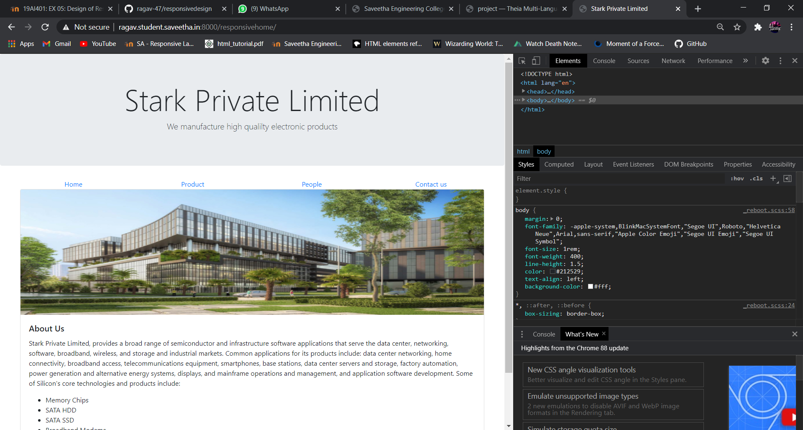
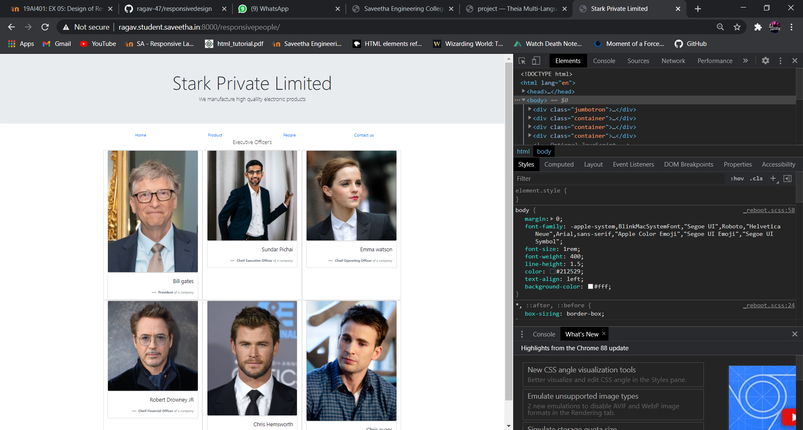
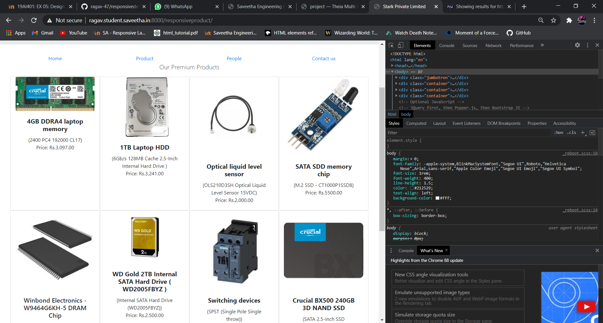
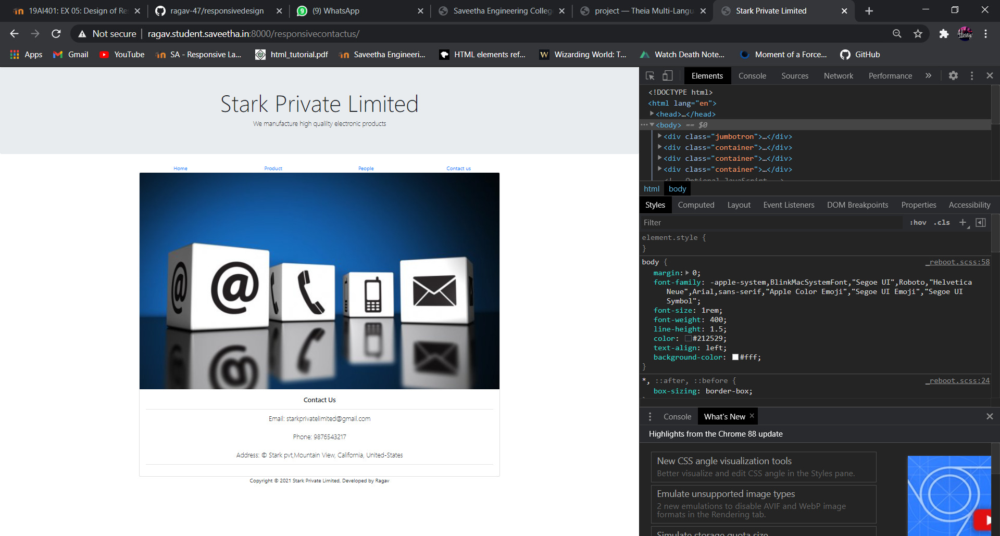

### Mobile view
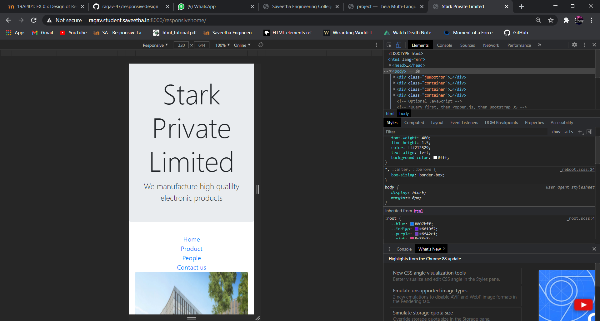
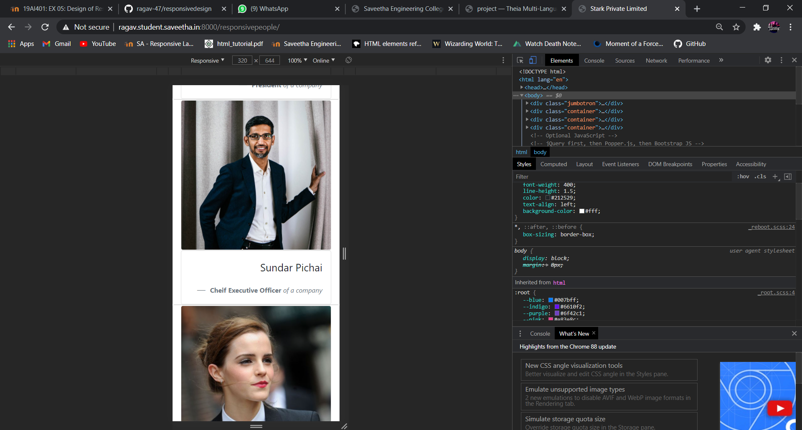
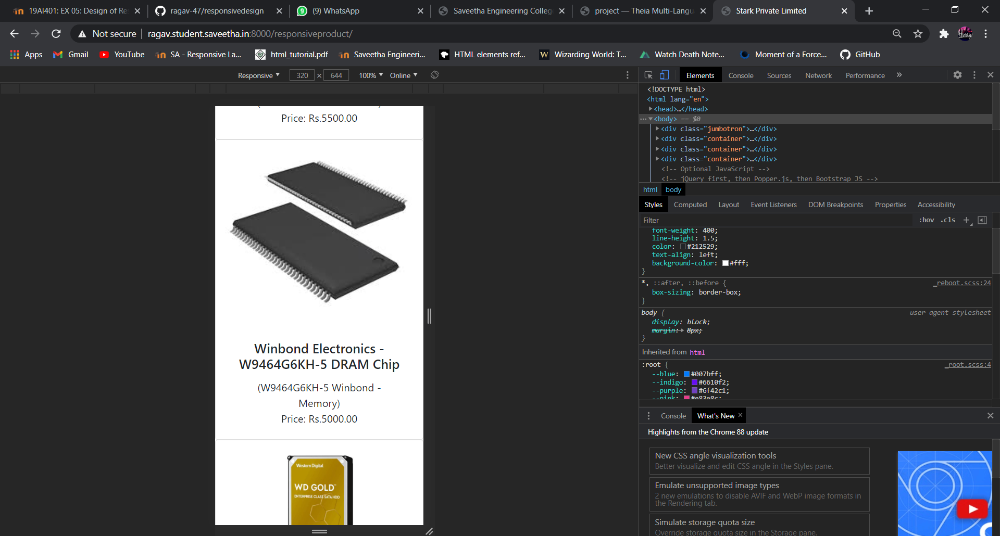
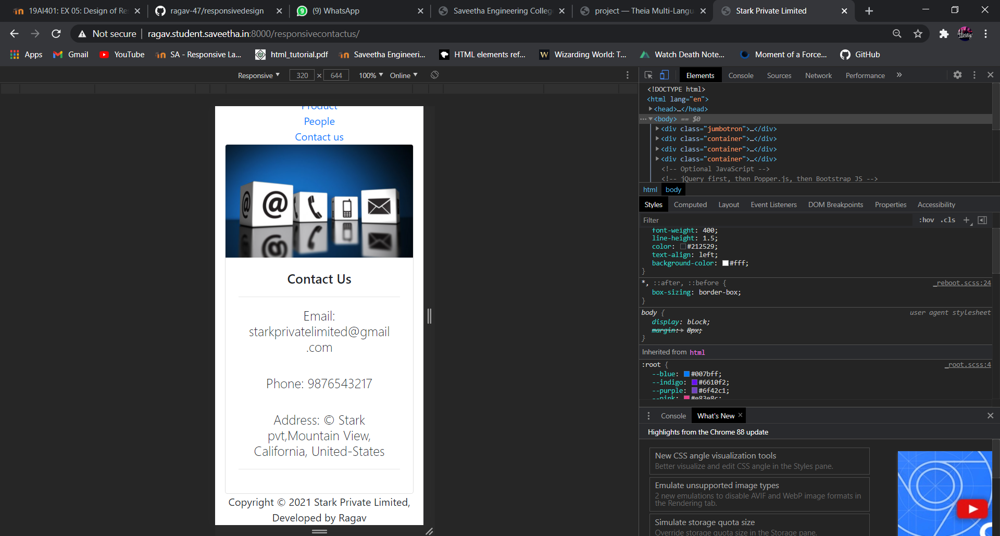

### Ipad view
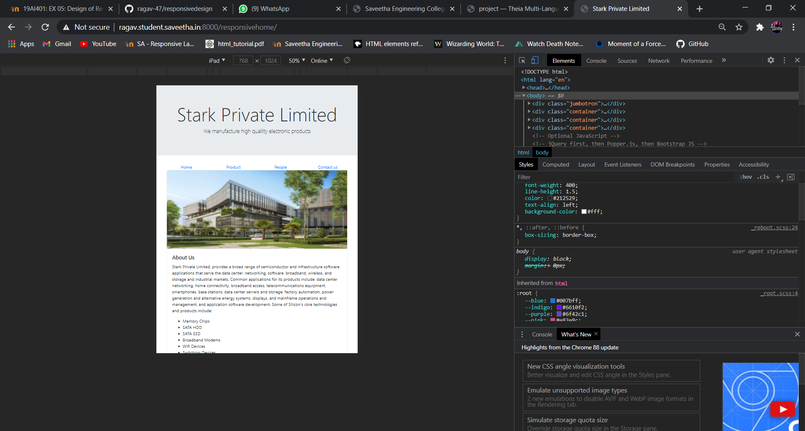
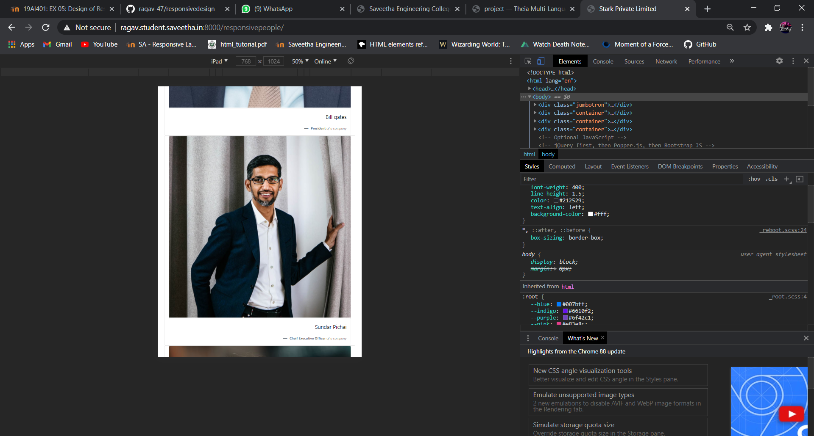
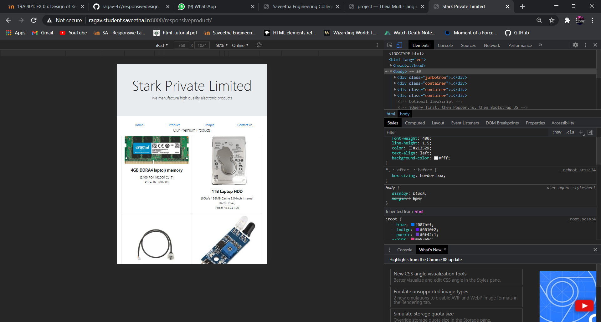
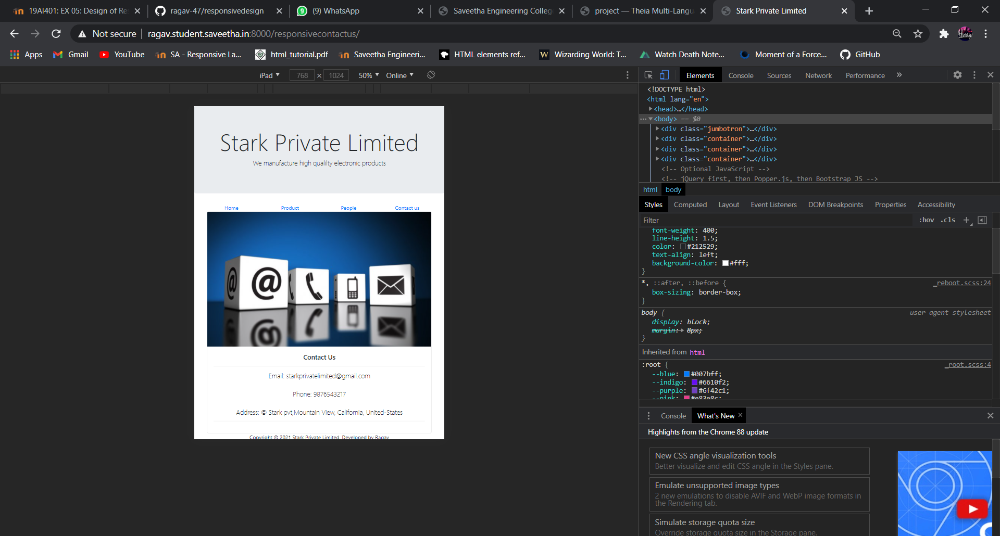

## valid report
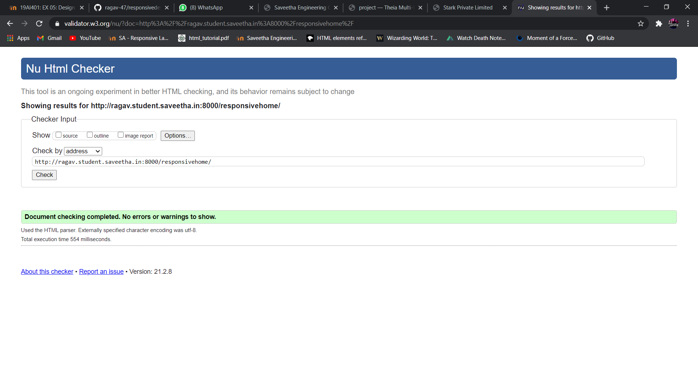

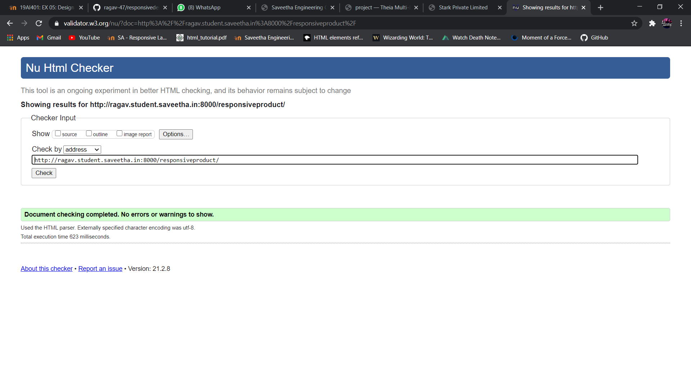


## RESULT:
Thus a website is designed for the responsive website with two break points and is hosted in the URL http://ragav.student.saveetha.in:8000/. HTML code is validated.